# OptiMiam — Rapport de projet annuel
## Master 2 — Architecture logicielle

> **Version de travail — consolidation des sections relues**

---

# 1. Présentation et contexte

## 1.1. Présentation du projet

OptiMiam est un prototype d'application destiné à centraliser la gestion des stocks alimentaires d'un foyer et les fonctionnalités qui en découlent : gestion des recettes, recommandations, planification des repas et préparation des courses.

L'idée initiale était principalement centrée sur la gestion d'un stock de congélateur. La réflexion a ensuite été élargie afin de prendre en compte l'ensemble des stocks alimentaires du foyer : congélateur, réfrigérateur, placard, conserves et bocaux.

L'objectif est de transformer ces informations en données utiles pour accompagner l'utilisateur dans l'organisation de ses repas.

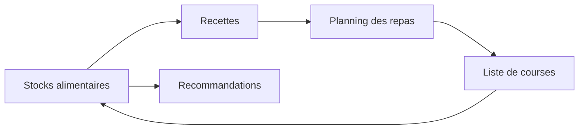

OptiMiam cherche ainsi à créer une boucle cohérente entre ce que l'utilisateur possède, ce qu'il souhaite cuisiner et ce qu'il doit acheter.

## 1.2. Origine de l'idée

L'idée initiale vient d'une solution présentée dans une vidéo consacrée à la gestion d'un stock de congélateur.

Le principe observé était d'associer une balance, une imprimante thermique et une application informatique afin d'enregistrer des aliments, leur poids et différentes informations associées.

Cette approche était cependant très spécifique à son contexte d'utilisation.

La réflexion a donc consisté à reprendre le principe de gestion du stock alimentaire et à l'élargir à un usage plus général.

Les applications de type « frigo connecté » ont également constitué une source d'inspiration. Elles permettent notamment de proposer des repas à partir du contenu du réfrigérateur, mais ne couvrent pas nécessairement l'ensemble des stocks alimentaires d'un foyer.

OptiMiam cherche donc à réunir ces deux approches.

## 1.3. Problématique

Plusieurs problèmes sont regroupés autour de la gestion quotidienne des repas :

- gaspillage alimentaire ;
- gestion des stocks ;
- suivi des dates de péremption ;
- organisation des courses ;
- planification des repas ;
- personnalisation ;
- suivi nutritionnel.

L'économie peut également constituer un objectif pour certains utilisateurs, notamment à travers l'optimisation des achats, mais elle ne constitue pas la motivation principale du projet.

## 1.4. Positionnement

OptiMiam s'adresse principalement aux particuliers.

Le système peut être utilisé par une personne seule, un couple ou une famille. Le niveau d'intérêt dépend notamment de la quantité de stock à gérer et du niveau d'organisation recherché.

Le projet n'a pas vocation à remplacer les solutions professionnelles de gestion de stocks utilisées dans la restauration.

---

# 2. Objectifs et périmètre

## 2.1. Objectif général

L'objectif est de proposer un point central permettant de gérer les stocks alimentaires et de les exploiter pour faciliter l'organisation des repas.

L'utilisateur doit pouvoir partir de son stock, organiser ses repas, identifier les produits nécessaires et générer une liste de courses.

## 2.2. Objectifs fonctionnels

Le prototype couvre notamment :

- l'authentification ;
- la gestion des utilisateurs ;
- la gestion du stock ;
- la gestion des produits ;
- la gestion des recettes ;
- les recommandations ;
- le planning des repas ;
- les listes de courses ;
- certaines informations nutritionnelles ;
- la gestion des pertes ;
- la simulation de périphériques matériels.

## 2.3. Objectifs techniques

Le projet repose sur :

- Java / Spring Boot pour le backend ;
- Angular pour le frontend ;
- Angular Material 3 pour l'interface ;
- PWA pour l'utilisation sur différents supports ;
- PostgreSQL pour la persistance ;
- JWT pour l'authentification ;
- Docker pour la conteneurisation ;
- Traefik comme reverse proxy.

## 2.4. Périmètre du POC

Le niveau de réalisation recherché est celui d'un **prototype fonctionnel** permettant de démontrer le concept.

L'objectif n'est pas de fournir immédiatement un produit commercial ou un MVP industriel.

Le prototype doit néanmoins être suffisamment fonctionnel pour pouvoir être présenté à un utilisateur extérieur au projet.

## 2.5. Fonctionnalités hors V1

Plusieurs évolutions sont envisagées mais ne sont pas considérées comme finalisées dans la V1 :

- fonctionnement hors ligne complet ;
- synchronisation avancée ;
- intégration de hardware réel ;
- intégration de données alimentaires externes complètes ;
- assistant conversationnel basé sur une IA ;
- intégration MCP ;
- automatisation complète des achats auprès des enseignes.

## 2.6. Contraintes

Le projet a été réalisé dans le cadre d'un projet annuel de Master 2, en parallèle d'une activité en alternance.

Le temps disponible constituait donc une contrainte importante.

Le projet a par conséquent privilégié une architecture simple, des technologies déjà maîtrisées et l'utilisation intensive d'outils d'assistance au développement.

---

# 3. Analyse fonctionnelle et conception

## 3.1. Vision fonctionnelle

Le fonctionnement global repose sur la circulation des données entre plusieurs fonctionnalités.

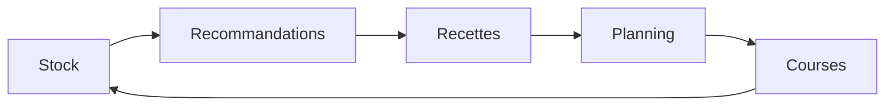

Le stock constitue l'un des éléments centraux du système.

## 3.2. Parcours utilisateur

Le parcours utilisateur idéal peut être résumé ainsi :

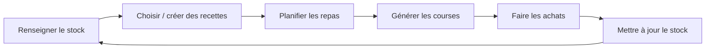

L'utilisateur peut également modifier manuellement les différentes informations lorsqu'elles ne correspondent pas exactement à la situation réelle.

## 3.3. Gestion du stock

Le stock permet de gérer les produits présents dans le foyer.

Les informations manipulées comprennent notamment :

- produit ;
- quantité ;
- unité ;
- date de péremption ;
- emplacement.

Le prototype permet l'ajout et la suppression de produits ainsi que la modification des quantités.

Le scan de produits est envisagé et peut être simulé dans le cadre du prototype.

## 3.4. Gestion des recettes

L'application permet de rechercher et consulter des recettes ainsi que d'en créer.

Les recettes sont structurées autour d'ingrédients associés à des produits et à des quantités.

Cette structuration permet de réutiliser les recettes dans les recommandations et dans la génération des courses.

## 3.5. Recommandations

Les recommandations cherchent à identifier les recettes les plus pertinentes selon l'état du stock.

La date de péremption joue notamment un rôle important afin de favoriser les recettes permettant de consommer rapidement certains produits.

Le système fournit également des explications sur les raisons de la recommandation.

## 3.6. Planning des repas

Le planning permet de préparer les repas à l'avance.

L'utilisateur peut associer des recettes à des repas planifiés et organiser ainsi sa semaine.

Le planning est ensuite exploité lors de la génération des courses.

## 3.7. Gestion des courses

La gestion des courses constitue le lien entre le planning des repas et le stock réel du foyer.

L'objectif n'est pas simplement de fournir une liste d'articles à cocher. OptiMiam cherche à déterminer automatiquement les produits réellement nécessaires en tenant compte des repas planifiés et des quantités déjà disponibles dans le stock.

Le principe est :

\[
Quantité\ à\ acheter =
\max(0,\ Quantité\ nécessaire - Quantité\ disponible)
\]

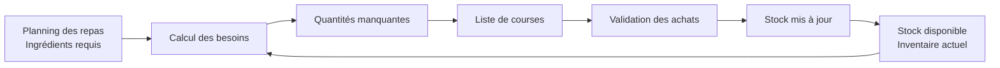

### Génération automatique

La méthode `generateFromPlanning` du `ShoppingListService` récupère les repas planifiés sur la période sélectionnée.

Les besoins sont agrégés et les quantités sont adaptées au nombre de portions.

Les unités compatibles sont normalisées, par exemple grammes/kilogrammes et millilitres/litres.

Le stock disponible est ensuite déduit du besoin.

Seuls les produits présentant un manque réel sont ajoutés automatiquement à la liste.

### Personnalisation

La liste est organisée par catégories ou rayons.

L'utilisateur peut ajouter manuellement des articles qui ne proviennent pas des recettes planifiées.

Les articles peuvent être cochés pendant les achats et une progression permet de visualiser l'avancement.

### Validation

Lors de la validation des achats, seuls les articles cochés sont pris en compte.

Une entrée `StockItem` est créée pour chaque produit acheté avec notamment :

- quantité ;
- unité ;
- date d'entrée ;
- date de conservation calculée ;
- emplacement.

La date de conservation est calculée à partir de la durée de conservation moyenne du produit :

\[
DLC =
Date_{entrée}
+
Durée_{conservation\ moyenne}
\]

La liste est ensuite marquée `COMPLETED` et un événement `PurchasesValidatedEvent` est publié.

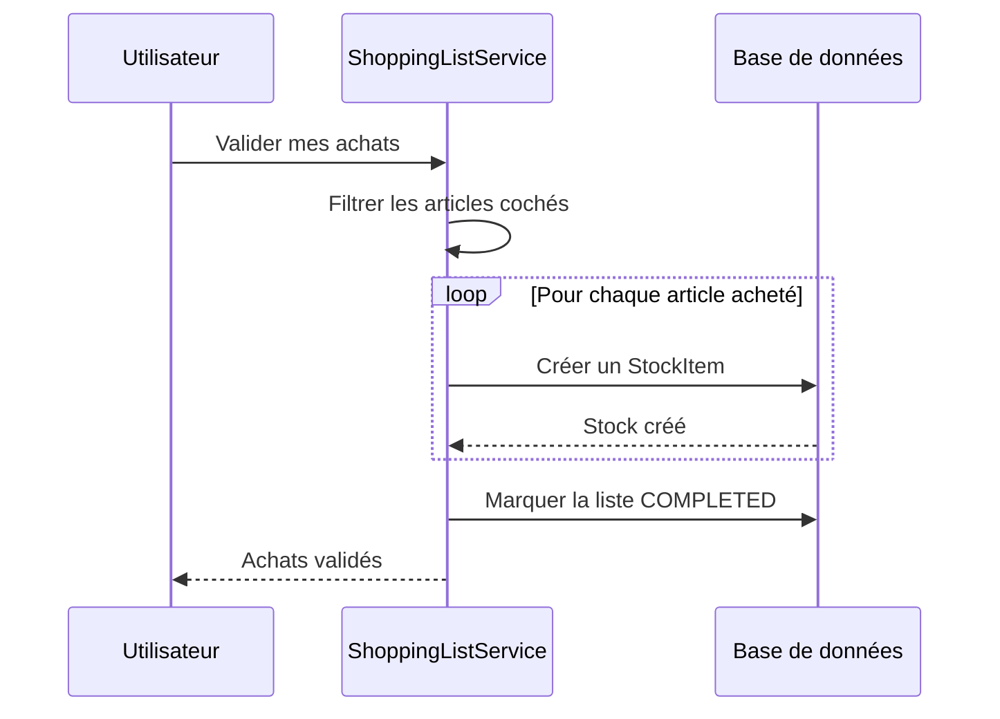

## 3.8. Anti-gaspillage

L'anti-gaspillage constitue une dimension importante du projet.

Les produits proches de leur date de péremption sont utilisés comme un critère de recommandation.

L'application peut donc favoriser une recette permettant de consommer des produits qui risqueraient autrement d'être perdus.

## 3.9. Nutrition

Les recettes et produits peuvent contenir des informations nutritionnelles telles que les calories, protéines, glucides, lipides, fibres et sel.

Dans la V1, ces informations sont principalement destinées à fournir un aperçu à l'utilisateur.

L'objectif n'est pas de produire une analyse nutritionnelle médicale ou une mesure issue d'un laboratoire.

## 3.10. Hardware simulé

Le projet prévoit l'utilisation future de périphériques physiques.

Dans le POC, ceux-ci sont simulés.

La balance sert notamment à simuler la pesée d'un aliment.

L'imprimante thermique est destinée à simuler l'impression d'étiquettes pour les produits.

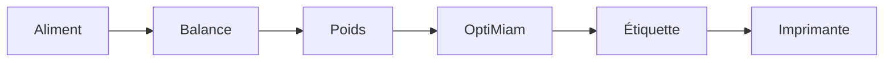

---

# 4. Architecture technique et choix technologiques

## 4.1. Vue d'ensemble

OptiMiam repose sur une architecture web séparant le frontend et le backend.

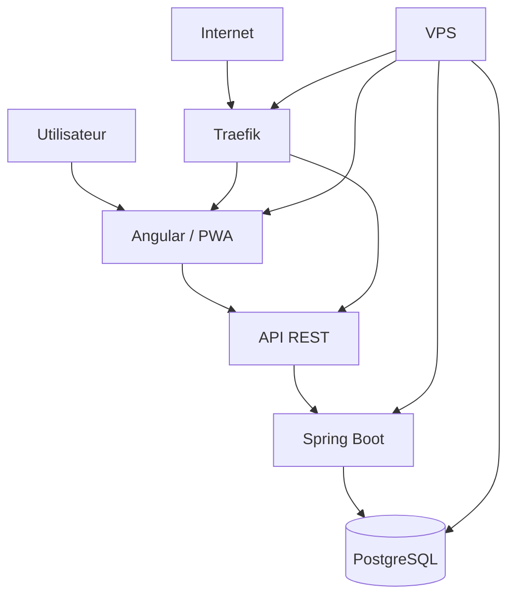

L'architecture reste volontairement simple car le projet est un POC.

## 4.2. Stack technique

| Couche | Technologie | Rôle |
|---|---|---|
| Frontend | Angular | Interface utilisateur |
| UI | Angular Material 3 | Composants graphiques |
| Application | PWA | Utilisation sur plusieurs supports |
| Backend | Java / Spring Boot | API et logique métier |
| API | REST | Communication frontend/backend |
| Persistance | PostgreSQL | Stockage des données |
| Authentification | JWT | Authentification |
| Conteneurisation | Docker | Packaging et exécution |
| Reverse proxy | Traefik | Routage |
| CI | GitHub Actions | Automatisation |
| Hébergement | VPS | Déploiement |

## 4.3. Architecture monolithique

Le backend est conçu comme une application monolithique.

Les différentes fonctionnalités sont séparées logiquement mais restent dans une même application Spring Boot.

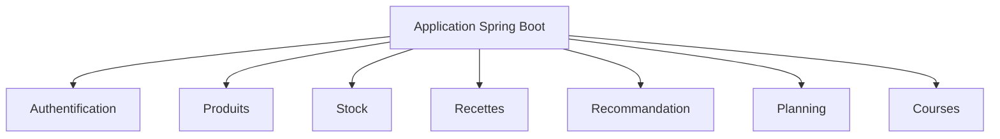

Cette approche évite d'introduire inutilement la complexité d'une architecture microservices.

## 4.4. Angular

Angular a été retenu car il s'agit d'une technologie déjà maîtrisée.

Ce choix permettait de limiter le temps consacré à l'apprentissage d'un framework et de se concentrer sur le produit.

## 4.5. Angular Material 3

Angular Material 3 fournit les composants graphiques nécessaires à la construction d'une interface cohérente.

Le choix permet de réduire le temps consacré au développement d'un système graphique personnalisé.

## 4.6. Spring Boot

Spring Boot a été choisi pour le backend car il est également maîtrisé.

Il fournit un écosystème adapté à la construction d'une API REST et à la gestion de la sécurité, des données et des tests.

## 4.7. PostgreSQL

PostgreSQL a été retenu comme système de gestion de base de données relationnelle.

Les données d'OptiMiam comportent de nombreuses relations entre utilisateurs, produits, stocks, recettes, ingrédients, repas et courses.

Une base relationnelle est donc adaptée à la structure du projet.

## 4.8. API REST

Le frontend communique avec Spring Boot au moyen d'une API REST.

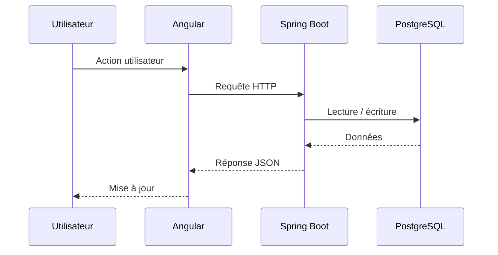

## 4.9. Authentification

L'authentification repose sur JWT.

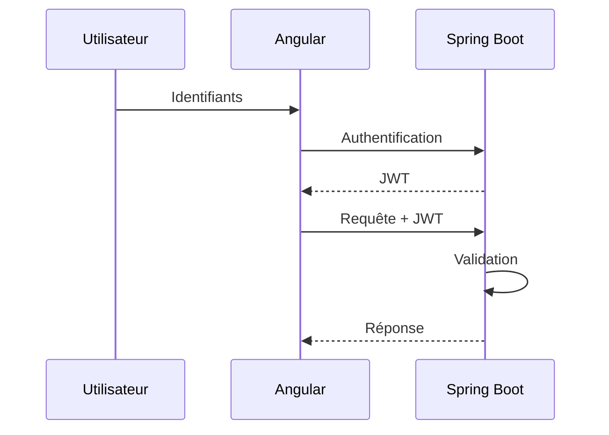

## 4.10. PWA

OptiMiam est configuré comme Progressive Web App.

Le principal objectif de cette V1 est de permettre l'installation sur un téléphone tout en conservant une application web Angular.

Le fonctionnement hors ligne complet n'est pas considéré comme finalisé dans cette version.

## 4.11. Docker

Le frontend et le backend sont construits sous forme d'images Docker.

La conteneurisation permet de disposer d'un environnement d'exécution reproductible.

## 4.12. Traefik

Traefik est utilisé comme reverse proxy.

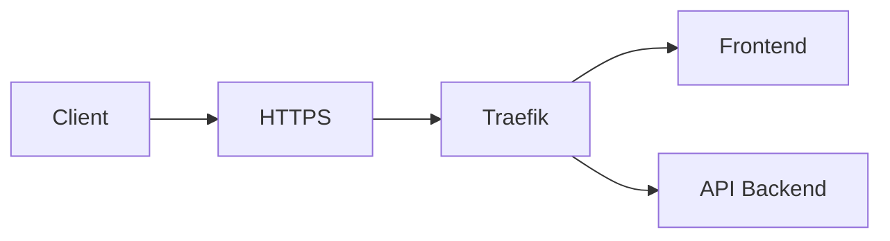

## 4.13. Déploiement

Le prototype est déployé sur un VPS.

Les composants sont exécutés sous Docker et Traefik constitue le point d'entrée public.

---

# 5. Conception technique du backend

## 5.1. Organisation

Le backend est organisé autour des différents domaines fonctionnels du projet.

Ce découpage ne correspond pas à une implémentation DDD.

Il est principalement issu du développement progressif du projet par étapes.

À l'intérieur des domaines, les responsabilités techniques sont séparées entre controllers, services, repositories, modèles et DTO.

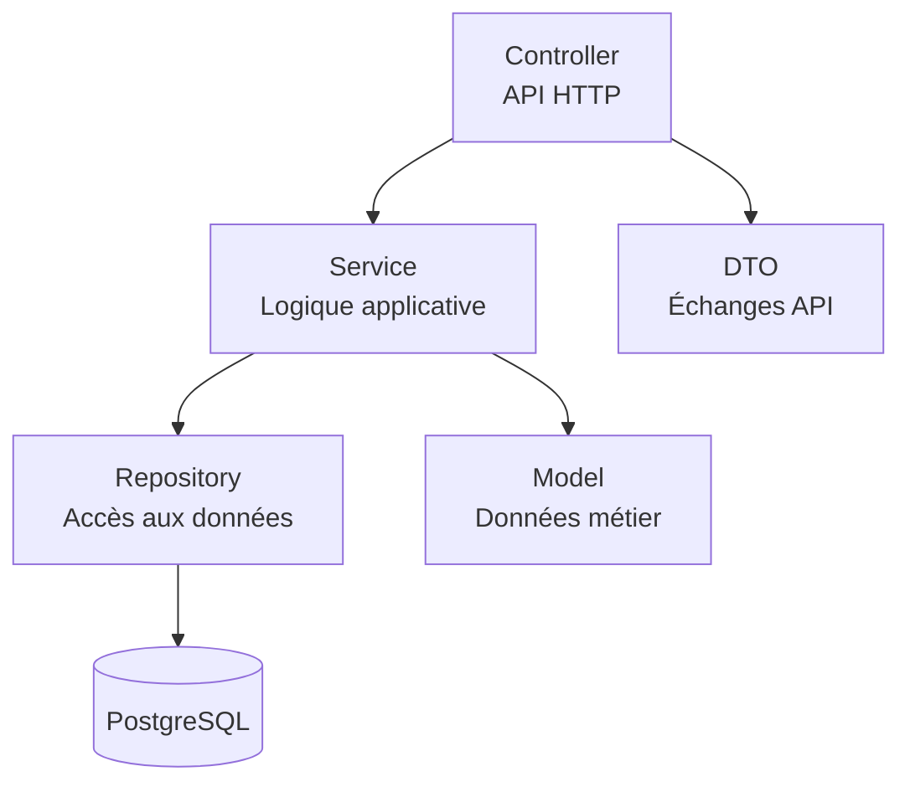

## 5.2. Controllers

Les controllers constituent les points d'entrée HTTP.

Ils reçoivent les requêtes et délèguent les traitements aux services.

## 5.3. Services

Les services regroupent les traitements applicatifs.

La génération d'une liste de courses constitue un exemple de traitement métier dépassant un simple CRUD.

## 5.4. Repositories

Les repositories assurent l'accès aux données persistées.

Ils permettent aux services de communiquer avec PostgreSQL sans gérer directement les détails de persistance.

## 5.5. DTO

Les DTO sont utilisés pour les échanges entre l'API et ses consommateurs.

Cette séparation évite de devoir exposer systématiquement les modèles internes du backend.

## 5.6. Modèle métier

Les concepts centraux sont notamment :

- utilisateurs ;
- produits ;
- éléments de stock ;
- recettes ;
- ingrédients ;
- repas planifiés ;
- listes de courses.

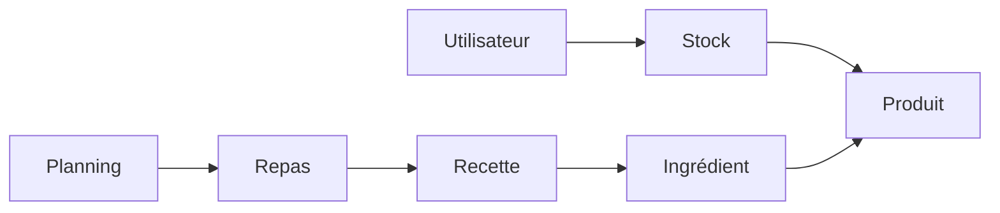

## 5.7. Produit et stock

Un produit représente une référence alimentaire.

Un `StockItem` représente une quantité effectivement présente dans le stock.

Cette distinction permet notamment de conserver des informations spécifiques à une présence physique du produit, comme la quantité et la date de péremption.

## 5.8. Recettes et ingrédients

Une recette est composée de plusieurs `RecipeIngredient`.

Chaque ingrédient est associé à un produit, une quantité et une unité.

Cette structure est utilisée à la fois par les recommandations et par la génération des courses.

## 5.9. Gestion des unités

Certaines unités compatibles sont converties lors des calculs.

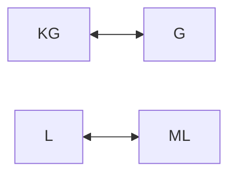

Par exemple :

\[
1kg = 1000g
\]

\[
1L = 1000ml
\]

## 5.10. Gestion des dates

Les dates de péremption sont utilisées pour identifier les produits nécessitant une attention particulière.

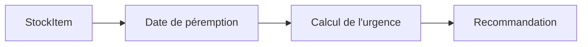

## 5.11. Cohérence des opérations

Certaines opérations modifient plusieurs données.

La validation des achats crée des éléments de stock, termine la liste puis publie un événement.

L'objectif est de conserver la cohérence entre ces différentes opérations.

## 5.12. Événements métier

Lors de la validation d'une liste de courses, `PurchasesValidatedEvent` est publié.

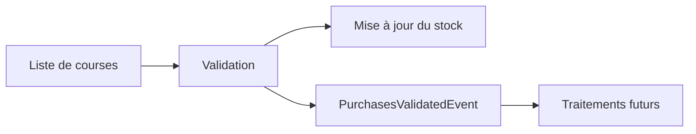

Cette approche permet notamment d'envisager de futurs traitements sans coupler directement toutes les fonctionnalités.

---

# 6. Frontend, PWA et expérience utilisateur

## 6.1. Organisation du frontend

Le frontend Angular constitue l'interface utilisateur.

Il communique avec le backend via l'API REST.

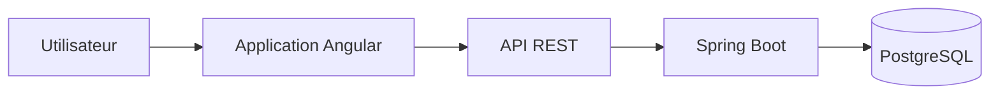

## 6.2. Interface responsive

L'application est conçue pour être utilisée sur ordinateur, tablette et téléphone.

Cette contrainte correspond aux situations d'utilisation identifiées : gestion à domicile, cuisine et courses en magasin.

## 6.3. Progressive Web App

La PWA permet l'installation de l'application sur un appareil compatible.

Elle évite de développer un client mobile natif séparé pour le prototype.

## 6.4. Fonctionnement hors ligne

Le fonctionnement hors ligne complet n'est pas finalisé dans la V1.

La PWA est principalement utilisée pour son installation et son utilisation sur différents supports.

Le mode offline complet constitue une évolution future.

## 6.5. Synchronisation future

Une version future pourrait conserver localement certaines données et opérations avant de les synchroniser avec le backend lors du retour de la connexion.

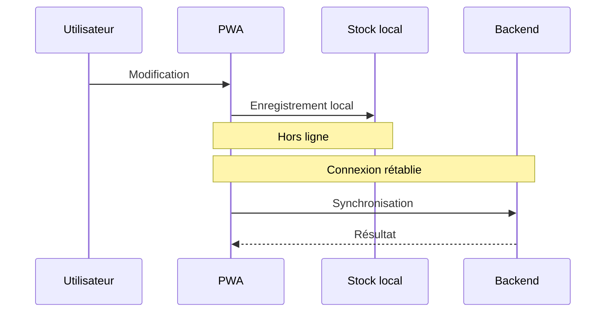

## 6.6. Gestion future des conflits

La synchronisation offline pourrait générer des conflits lorsque les mêmes données sont modifiées depuis plusieurs sources.

Une stratégie future pourrait résoudre automatiquement les cas simples et demander une intervention dans les situations ambiguës.

## 6.7. Cohérence des interfaces

Les fonctionnalités ne sont pas pensées comme des modules indépendants.

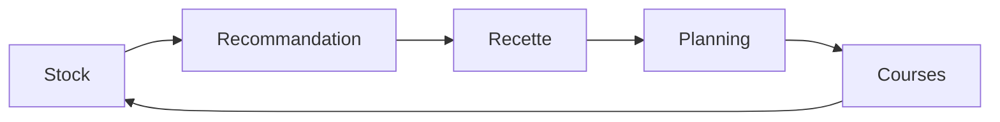

Cette circulation des données constitue une partie importante de la valeur du produit.

## 6.8. Limites

Le prototype reste perfectible.

La saisie initiale d'un stock important est notamment fastidieuse. Le scan automatisé, le hardware et l'offline pourraient réduire ces contraintes dans une version future.

---

# 7. Moteur de recommandation

## 7.1. Objectif

Le moteur de recommandation cherche à identifier les recettes les plus pertinentes par rapport au contexte actuel de l'utilisateur.

La V1 repose sur une stratégie déterministe.

Aucun modèle d'intelligence artificielle n'intervient dans le calcul.

## 7.2. Filtrage

Les recettes peuvent être filtrées selon :

- temps maximal ;
- difficulté ;
- tag.

Les recettes ne respectant pas les critères sont retirées avant le calcul du score.

## 7.3. Portions

Le nombre de portions demandé est utilisé pour adapter les quantités.

\[
ratio =
\frac{portions\ demandées}
{portions\ de\ la\ recette}
\]

\[
quantité_{nécessaire}
=
quantité_{recette}
\times ratio
\]

## 7.4. Compatibilité avec le stock

Pour chaque ingrédient obligatoire, les quantités disponibles sont recherchées dans le stock.

Les unités compatibles sont normalisées avant comparaison.

## 7.5. Taux de correspondance

Le moteur calcule :

\[
Match\% =
\frac{nombre\ d'ingrédients\ disponibles}
{nombre\ d'ingrédients\ obligatoires}
\times 100
\]

Un résultat de 100 % signifie que tous les ingrédients obligatoires sont disponibles en quantité suffisante.

## 7.6. Urgence

Un produit dont la date de péremption est à trois jours ou moins est considéré comme urgent.

| Situation | Score |
|---|---:|
| Aujourd'hui ou dépassé | +50 |
| Demain | +40 |
| Dans 2 ou 3 jours | +25 |

Cette logique favorise les recettes permettant de consommer les produits rapidement.

## 7.7. Score

Le score global est calculé selon :

\[
Score =
(Match\% \times 0,40)
+ UrgencyScore
+ Bonus
\]

Les bonus sont notamment :

| Critère | Bonus |
|---|---:|
| Stock complet | +15 |
| Recette ≤ 20 min | +10 |
| Tag `Anti-gaspi` | +10 |

## 7.8. Explicabilité

Le moteur renvoie également des raisons compréhensibles.

Il peut notamment indiquer qu'une recette permet de sauver plusieurs produits à consommer rapidement ou que tous les ingrédients sont disponibles.

## 7.9. Ingrédients manquants

Lorsque la quantité disponible est insuffisante :

\[
quantité_{manquante}
=
quantité_{nécessaire}
-
quantité_{disponible}
\]

Les quantités manquantes sont retournées avec la recommandation.

## 7.10. Classement

Le classement final utilise :

```text
Score décroissant
→ Match % décroissant
→ Temps croissant
→ Nom croissant
```

## 7.11. Pourquoi une stratégie déterministe ?

Les données utilisées sont structurées et les règles sont explicites.

Un algorithme déterministe permet donc d'obtenir un comportement reproductible, testable et maîtrisé.

L'IA pourrait intervenir ultérieurement comme couche d'interprétation ou de recommandation avancée, mais elle ne constitue pas la source de vérité métier.

---

# 8. Tests et qualité

## 8.1. Stratégie

L'utilisation intensive de l'IA pour le développement rend la validation du code particulièrement importante.

Le projet utilise des tests automatisés pour vérifier le comportement du système.

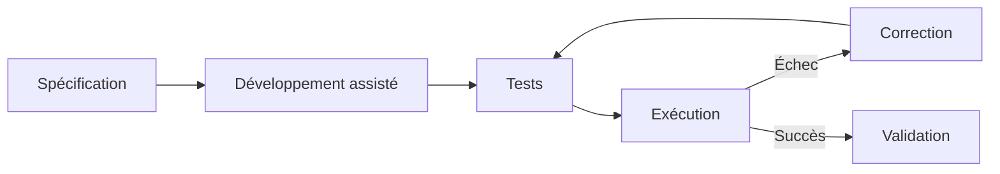

## 8.2. Tests unitaires

Les tests unitaires vérifient le comportement de composants isolés.

Le moteur de recommandation est particulièrement adapté à cette approche grâce à son fonctionnement déterministe.

## 8.3. Tests d'intégration

Les tests d'intégration vérifient les interactions entre plusieurs composants, notamment les opérations liées au stock et aux courses.

## 8.4. Tests du stock

Des scénarios permettent notamment de vérifier la consommation de produits et la création des mouvements correspondants.

## 8.5. Tests de synchronisation

Des scénarios testent également des opérations lorsque les quantités disponibles côté serveur sont insuffisantes.

## 8.6. Tests du hardware simulé

La balance simulée permet de vérifier des mesures et une tare.

L'imprimante simulée permet de vérifier le comportement associé aux demandes d'impression.

## 8.7. Résultats

L'exécution de référence fournie pour le projet donne :

| Indicateur | Résultat |
|---|---:|
| Tests exécutés | **53** |
| Échecs | **0** |
| Erreurs | **0** |
| Tests ignorés | **0** |
| Build | **SUCCESS** |
| Durée | **7,410 s** |

Ces résultats montrent que les 53 tests de cette exécution ont été validés.

Ils ne permettent toutefois pas de conclure à l'absence totale de défauts.

---

# 9. CI/CD et déploiement

## 9.1. Vue d'ensemble

Le projet dispose d'une chaîne d'intégration permettant d'automatiser une partie du processus entre le dépôt Git et les images Docker.

```mermaid
flowchart LR
    Developer["Développeur"] --> GitHub["GitHub"]
    GitHub --> Actions["GitHub Actions"]
    Actions --> Tests["Tests"]
    Tests --> Build["Build"]
    Build --> Images["Images Docker"]
```

## 9.2. Intégration continue

Un push dans le dépôt peut déclencher les étapes de vérification et de build.

```mermaid
flowchart TD
    Push["git push"] --> CI["CI"]
    CI --> Tests["Tests"]
    Tests -->|Échec| Failed["Échec"]
    Tests -->|Succès| Build["Build"]
    Build --> Publish["Publication"]
```

## 9.3. Conteneurisation

Le frontend et le backend sont construits comme images Docker.

```mermaid
flowchart LR
    Source["Code"] --> Front["Build Frontend"]
    Source --> Back["Build Backend"]

    Front --> FrontImage["Image Docker Frontend"]
    Back --> BackImage["Image Docker Backend"]
```

## 9.4. Déploiement

Le prototype est hébergé sur un VPS.

Traefik sert de point d'entrée et route les requêtes vers les services.

```mermaid
flowchart TB
    Internet["Internet"] --> Traefik["Traefik"]

    subgraph VPS["VPS"]
        Traefik --> Front["Frontend"]
        Traefik --> Backend["Spring Boot"]
        Backend --> DB[("PostgreSQL")]
    end
```

## 9.5. Limites

Le processus de build est automatisé, mais le déploiement complet n'est pas entièrement automatisé.

Certaines opérations restent manuelles sur le VPS.

---

# 10. Développement assisté par IA

## 10.1. Méthode

L'intelligence artificielle a été utilisée à plusieurs niveaux du projet.

```mermaid
flowchart LR
    Idea["Idée"] --> ChatGPT["ChatGPT"]
    ChatGPT --> Architecture["Architecture"]
    Architecture --> Plan["Plan"]
    Plan --> Gemini["Gemini / Antigravity"]
    Gemini --> Code["Code"]
    Code --> Tests["Tests"]
    Tests --> Validation["Validation"]
```

## 10.2. Structuration du besoin

ChatGPT a d'abord été utilisé pour synthétiser les informations issues des échanges autour du projet et structurer le besoin.

Cette étape a conduit à la production d'un document d'architecture technique.

## 10.3. Planification

Le document d'architecture a ensuite été fourni à Gemini via Antigravity dans IntelliJ.

L'objectif était de produire un plan étape par étape avant de générer le code.

## 10.4. Génération progressive

Le projet a ensuite été construit progressivement, fonctionnalité après fonctionnalité.

À chaque étape, l'IA pouvait produire du code et les tests associés.

## 10.5. Rôle du développeur

Le rôle humain s'est déplacé vers :

> **spécifier → guider → vérifier → tester → corriger → valider**

Les choix d'architecture et les contraintes restent définis et contrôlés par le développeur.

## 10.6. Importance du contexte

L'expérience a montré qu'une demande générale produit des résultats beaucoup moins fiables qu'une demande accompagnée d'un contexte précis.

L'architecture, les contraintes techniques, les règles métier et le plan de développement ont donc constitué un contexte de référence pour l'IA.

## 10.7. Validation

Le code généré n'est pas considéré comme fiable par défaut.

Il doit être compilé, exécuté et testé.

Les tests automatisés constituent un garde-fou important dans ce mode de développement.

## 10.8. Limites

L'IA peut produire une implémentation techniquement cohérente mais incorrecte par rapport au besoin.

Elle peut également prendre des décisions qui ne correspondent pas aux choix précédents.

Le maintien d'une documentation et d'un plan de développement permet de limiter ces dérives.

## 10.9. Bilan

L'IA a permis d'accélérer fortement la réalisation du prototype.

Cette accélération n'a cependant été possible que grâce à un travail préalable de spécification et à une validation régulière du résultat.

L'IA a donc été utilisée comme un **multiplicateur de productivité**, et non comme un remplacement de la réflexion technique.

---

# 11. Exploitation et démonstration

## 11.1. Environnement accessible

Le prototype dispose d'un environnement accessible à distance.

Le jury pourra ainsi découvrir l'application depuis un navigateur, sur ordinateur ou téléphone.

## 11.2. Données de démonstration

Des données de démonstration permettent de présenter les différentes fonctionnalités sans dépendre du stock alimentaire réel du développeur.

Cette approche permet de construire un scénario reproductible.

## 11.3. Démonstration

La démonstration pourra notamment suivre le parcours suivant :

```mermaid
flowchart LR
    Login["Connexion"] --> Stock["Consultation du stock"]
    Stock --> Recommendations["Recommandations"]
    Recommendations --> Recipe["Choix d'une recette"]
    Recipe --> Planning["Planification"]
    Planning --> Shopping["Génération des courses"]
    Shopping --> Purchase["Validation"]
    Purchase --> StockUpdate["Mise à jour du stock"]
```

Ce parcours permet de démontrer la cohérence entre les principales fonctionnalités plutôt que de présenter uniquement une succession d'écrans.

---

# 12. Limites et perspectives

## 12.1. Limites du prototype

OptiMiam reste un POC.

Les données alimentaires doivent encore être enrichies et certaines interactions nécessitent une saisie manuelle importante.

Le hardware réel et le fonctionnement offline complet ne sont pas intégrés.

## 12.2. Données alimentaires

Une future version pourrait utiliser des sources externes telles qu'Open Food Facts pour enrichir automatiquement les informations produit.

```mermaid
flowchart LR
    Barcode["Code-barres"] --> External["Base alimentaire"]
    External --> Product["Informations produit"]
    Product --> OptiMiam["OptiMiam"]
```

## 12.3. Scan de produits

La caméra du téléphone ou un scanner dédié pourrait identifier automatiquement un produit et préremplir ses informations.

## 12.4. Hardware réel

Une future version pourrait intégrer une véritable balance et une imprimante thermique.

La logique métier développée pour les périphériques simulés pourrait servir de base à cette intégration.

## 12.5. Dispositif IoT

Un dispositif fixe installé dans la cuisine pourrait intégrer une caméra ou un scanner, un écran et quelques commandes.

```mermaid
flowchart TB
    Device["Dispositif cuisine"]
    Device --> Camera["Caméra / scanner"]
    Device --> Display["Écran"]
    Device --> Buttons["Commandes"]
    Device --> Network["Réseau"]
    Network --> API["API OptiMiam"]
```

## 12.6. Offline complet

Une version future pourrait conserver localement certaines données et opérations, puis les synchroniser avec le backend.

La résolution des conflits devra alors être étudiée.

## 12.7. Recommandation avancée

Le moteur actuel pourrait être enrichi avec davantage de critères :

```mermaid
flowchart TD
    Stock["Stock"] --> Recommendation["Recommandation"]
    Preferences["Préférences"] --> Recommendation
    History["Historique"] --> Recommendation
    Season["Saisonnalité"] --> Recommendation
    Nutrition["Objectifs nutritionnels"] --> Recommendation
```

## 12.8. IA conversationnelle

Une future version pourrait intégrer une IA conversationnelle comme couche d'interaction.

Elle pourrait par exemple interpréter une demande utilisateur et utiliser les fonctionnalités existantes du backend.

```mermaid
flowchart LR
    User["Utilisateur"] --> AI["Assistant IA"]
    AI --> MCP["MCP"]
    MCP --> API["API OptiMiam"]
    API --> Stock["Stock"]
    API --> Recipes["Recettes"]
    API --> Planning["Planning"]
    API --> Shopping["Courses"]
```

## 12.9. Séparation entre IA et métier

L'IA ne devrait pas devenir la source de vérité.

Le backend resterait responsable des données et des règles métier.

L'IA pourrait interpréter une demande ou proposer une action, mais la validation resterait réalisée par le système.

---

# 13. Bilan du projet

## 13.1. Bilan fonctionnel

Le projet a permis de transformer une idée initialement centrée sur la gestion d'un stock de congélateur en un prototype plus large de gestion alimentaire.

Le système relie plusieurs fonctionnalités qui prennent leur sens lorsqu'elles sont utilisées ensemble.

```mermaid
flowchart LR
    Stock["Stock"] --> Recommendation["Recommandations"]
    Recommendation --> Recipes["Recettes"]
    Recipes --> Planning["Planning"]
    Planning --> Shopping["Courses"]
    Shopping --> Stock
```

## 13.2. Bilan technique

Le projet a permis de mettre en œuvre une application complète basée sur :

**Angular + Angular Material 3 + PWA + Spring Boot + PostgreSQL + Docker + Traefik**

L'application dispose également de tests automatisés et d'un environnement de déploiement accessible.

## 13.3. Bilan sur l'utilisation de l'IA

L'utilisation de l'IA a constitué une expérience importante du projet.

Une grande partie du code a pu être générée à partir d'une architecture, de contraintes et d'un plan précis.

Cette expérience montre que l'IA permet aujourd'hui d'accélérer fortement la réalisation d'un prototype.

Elle montre également que la génération de code ne remplace pas la définition du besoin, la conception, les choix techniques et la validation.

## 13.4. Retour personnel

Le projet a permis d'expérimenter une méthode de développement fortement assistée par l'IA.

L'un des principaux enseignements concerne la différence entre demander à une IA de « construire une application » et lui fournir un cadre suffisamment précis pour qu'elle puisse comprendre ce qui doit être construit.

Le document d'architecture, le découpage par étapes et les tests ont constitué des éléments importants pour conserver le contrôle du développement.

## 13.5. Conclusion

OptiMiam est parti d'une problématique simple : **mieux gérer les stocks alimentaires d'un foyer**.

La réflexion a progressivement conduit à considérer le stock comme une donnée pouvant alimenter plusieurs services : recommandations, recettes, planning et courses.

Le prototype obtenu permet de démontrer cette approche à travers une application web installable sur mobile, un backend Spring Boot, une base PostgreSQL et une infrastructure conteneurisée.

Le projet ne constitue pas un produit final. Plusieurs évolutions restent nécessaires avant d'envisager un véritable MVP : données alimentaires réelles, scan automatisé, fonctionnement hors ligne complet, hardware et éventuellement assistant conversationnel.

Cette limitation reste cohérente avec l'objectif initial du projet : **valider le concept et démontrer sa faisabilité technique**.

L'un des principaux enseignements du projet concerne finalement moins OptiMiam lui-même que la manière de le développer.

> **L'IA permet de générer rapidement du logiciel ; elle ne remplace pas la nécessité de savoir quel logiciel doit être construit et comment vérifier qu'il répond réellement au problème.**


