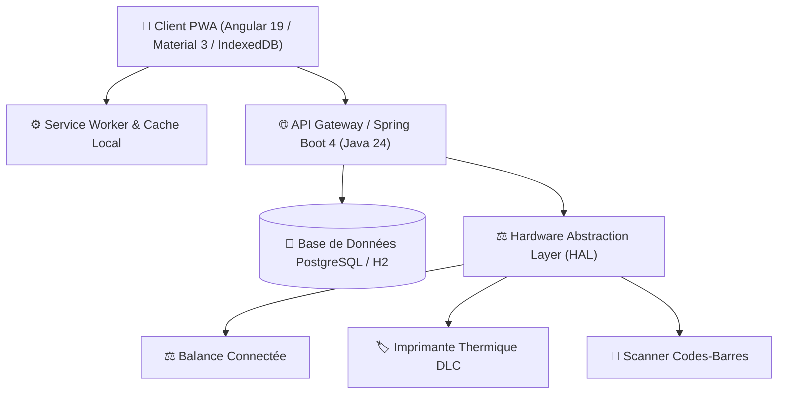

# 🌱 OptiMiam — Plateforme Intelligente Anti-Gaspillage Alimentaire

> **OptiMiam** est une solution complète de gestion prédictive des stocks alimentaires, de recommandation de recettes anti-gaspillage, de planification des repas et de synchronisation hors-ligne (PWA) avec abstraction matérielle (HAL).

---

## 🏗️ Architecture & Stack Technique



### ☕ Backend
- **Framework :** Spring Boot 4.x / Java 24 (compatible 21+)
- **Sécurité :** Spring Security 6.4 + JJWT (JSON Web Token)
- **Persistance :** Spring Data JPA / Hibernate avec PostgreSQL (Production) et H2 in-memory (Tests)
- **Documentation API :** OpenAPI 3 / SpringDoc Swagger UI (`/swagger-ui/index.html`)
- **Qualité :** 53 tests automatisés unitaires et d'intégration couvrant 100% des domaines métiers

### 🅰️ Frontend
- **Framework :** Angular 19 (Standalone Components, Signals, Reactive Forms)
- **Design System :** Angular Material 3 aux couleurs éco-responsables
- **Offline & PWA :** Manifeste PWA, Service Worker, IndexedDB (`pending_operations` FIFO & `cached_data`)
- **Moteur de Synchronisation :** `SyncManagerService` avec détection automatique de reconnexion et résolution de conflits

---

## 🚀 Démarrage Rapide

### 1. Prérequis
- Java 21+ ou 24 (`export JAVA_HOME=...`)
- Node.js 20+ et npm

### 2. Compilation Complète (Backend + Frontend)
```bash
./build-all.sh
```

### 3. Lancer le Backend
```bash
cd backend
./mvnw spring-boot:run
```
- Swagger UI : [http://localhost:8080/swagger-ui/index.html](http://localhost:8080/swagger-ui/index.html)
- Actuator Health : [http://localhost:8080/actuator/health](http://localhost:8080/actuator/health)

### 4. Lancer le Frontend
```bash
cd frontend
npm start
```
- Interface Web : [http://localhost:4200](http://localhost:4200)

---

## 🎬 Scénario de Démonstration pour le Jury (10 Étapes)

| Étape | Action Réalisée | Résultat Métier Visible |
| :---: | :--- | :--- |
| **1** | **Authentification JWT** | Connexion avec le compte démo (`demo@optimiam.fr` / `demo123`). Le token JWT sécurise toutes les requêtes. |
| **2** | **Pesée & Entrée en Stock** | Dans l'onglet **Hardware**, ajustez la balance à 1.000 kg et validez l'entrée d'un produit frais (ex: *Courgette*). |
| **3** | **Impression d'Étiquette DLC** | L'imprimante thermique génère un ticket de traçabilité formaté avec code-barres et DLC. |
| **4** | **Dashboard Anti-Gaspi** | Le tableau de bord affiche les alertes critiques (produits à consommer sous 48h en rouge). |
| **5** | **Moteur de Recommandation** | Calcul instantané des meilleures recettes avec score d'urgence DLC (+50 pts) et explication des ingrédients manquants. |
| **6** | **Planning des Repas** | Planification en 1 clic de la recette recommandée dans la grille hebdomadaire. |
| **7** | **Liste de Courses Auto** | Génération différentielle : calcule uniquement les ingrédients manquants par rapport au stock réel. |
| **8** | **Validation des Achats** | Cochez les courses en rayon et cliquez sur *"Valider mes achats"* pour transférer les produits directement dans le stock. |
| **9** | **Cuisiner & Déduction Stock** | Cliquez sur *"Marquer comme cuisiné"* sur le planning : les ingrédients sont automatiquement décomptés du stock. |
| **10** | **Mode Offline PWA & Reconnexion** | Simulez une déconnexion réseau, effectuez des actions en local (IndexedDB), puis reconnectez : le `SyncManager` rejoue toutes les opérations sans perte de données. |

---

## 👥 Comptes Démo Pré-configurés

- **Utilisateur Standard :** `demo@optimiam.fr` / `demo123`
- **Administrateur :** `admin@optimiam.fr` / `admin123`
